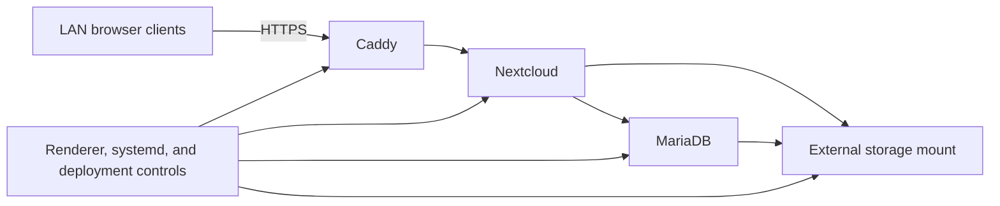

# Nextcloud Pi Server

A production-minded homelab case study for running Nextcloud on a Raspberry Pi.
The repository captures the reproducible engineering implementation—sanitized
configuration, guarded deployment automation, recovery tooling, tests, and
design decisions—without publishing the live server instance.

## Architecture

The deployment combines three Compose services with host-level storage and
startup controls:

- **Caddy** terminates private HTTPS and proxies to Nextcloud.
- **Nextcloud** provides browser-based file access.
- **MariaDB** stores application metadata.
- **External storage** holds application and database state behind mount gates.
- **systemd and deployment controls** prevent unsafe startup, validate locked
  images, and require reviewed deployment transactions.

The tracked files are templates. An ignored, mode-`0600` deployment environment
supplies local identity to the renderer, while database credentials remain in a
separate Pi-only Compose environment.

## Engineering highlights

- deterministic rendering of Compose, Caddy, systemd, launcher, and fstab
  configuration;
- storage-gated startup that prevents accidental host-local data directories;
- image locking, offline image recovery, and archive-specific attestation;
- configuration and runtime backup verification with explicit rollback paths;
- plan/apply deployment transactions with short-lived approval artifacts;
- health checks covering storage, images, containers, MariaDB, Nextcloud, and
  HTTPS;
- validated macOS and Windows browser access over a wired LAN; and
- automated shell, rendering, Compose, Caddy, documentation-link, secret, and
  full-history publication-safety checks.

## Security and publication boundary

This project publishes sanitized templates, repository-authored automation,
tests, and documentation. It does **not** publish real environment files,
credentials, hostnames, LAN addresses, storage identifiers, private
certificates, database contents, user data, runtime volumes, rendered live
configuration, diagnostics, or backup archives.

The repository represents how the system is reproduced and operated, not a
byte-for-byte copy of the Raspberry Pi. See
[security boundaries](docs/security-boundaries.md) and
[known risks](docs/known-risks.md) before handling deployment material.

## Deployment flow

1. Create the ignored deployment environment from the tracked example.
2. Render configuration into a new protected directory.
3. Run read-only preflight and validate required recovery artifacts.
4. Review the redacted plan and explicitly approve the one-time apply.
5. Validate service health and use verified rollback state if apply fails.

Rendering alone never authorizes a live change. The complete procedure and its
approval boundaries live in the [deployment guide](docs/deployment.md).

## Documentation

- [Architecture](docs/architecture.md) and
  [configuration model](docs/current-configuration.md)
- [Deployment](docs/deployment.md) and [operations](docs/operations.md)
- [Backup and rollback](docs/backup-and-rollback.md) and
  [recovery](docs/recovery.md)
- [Security boundaries](docs/security-boundaries.md) and
  [known risks](docs/known-risks.md)
- [Storage](docs/storage.md) and [startup](docs/startup.md)
- [Client access](docs/client-access.md)

## Validation evidence

The public-safety workflow exercises the same renderer with synthetic values,
validates the rendered Compose and Caddy configuration, runs repository
regression tests, checks documentation links, and scans both the current tree
and all reachable history. Gitleaks provides a separate full-history secret
scan. The client-access guide records the validated browser workflow without
including screenshots or artifacts from the live instance.

No binary portfolio evidence is included because no screenshot or diagnostic
artifact has yet passed the required manual sensitive-information review.

## Maintenance status

This is a personal homelab and portfolio project. It documents one deliberately
bounded deployment and is not an upstream Nextcloud distribution, a general
installer, or a guaranteed support product.
